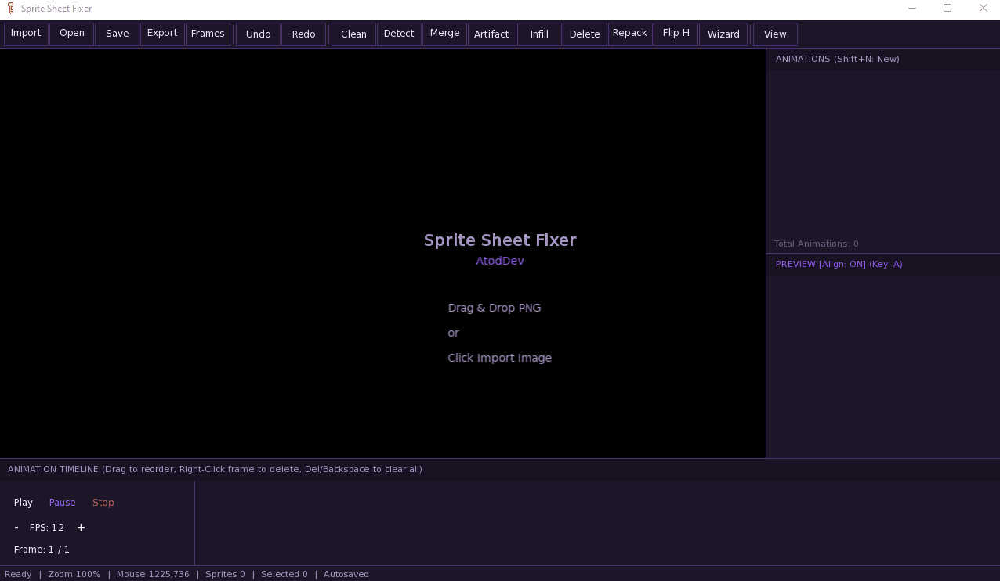

# Sprite Sheet Fixer

<p align="center">
  
</p>

<p align="center">
  <a href="https://github.com/Ahmad1827/sprite-sheet-fixer/releases/latest">
    
  </a>
  <a href="https://github.com/Ahmad1827/sprite-sheet-fixer/releases">
    
  </a>
  
  
</p>

---

A professional, cross-platform sprite sheet processing and animation preparation tool built with **C++17** and **SFML**.

Sprite Sheet Fixer is designed as a standalone engine module that automatically detects sprites, aligns animation frames, edits pivots and baselines non-destructively, previews animations in real time, and exports production-ready sprite atlases with metadata.

The architecture is intentionally separated into a reusable **Core engine** and an embeddable **UI module**, allowing the tool to be integrated into larger applications such as **Wisdom Park** without modifying its processing pipeline.

---

# Features

## Image Import

- Import PNG sprite sheets
- Cross-platform file dialogs (Linux / Windows)
- Large texture support
- Immutable source texture architecture

---

## Automatic Sprite Detection

- Connected Component Labeling (CCL)
- Alpha-based sprite extraction
- Automatic bounding box generation
- Batch sprite detection

---

## Sprite Editing

- Interactive sprite selection
- Resize selection
- Pivot editing
- Baseline editing
- Sprite alignment tools
- Multi-sprite selection support

---

## Animation Tools

- Animation creation
- Timeline editor
- Frame ordering
- Playback controls
- Live animation preview
- FPS adjustment
- Automatic animation builder

---

## Alignment Engine

- Automatic baseline detection
- Frame alignment
- Uniform animation positioning
- Batch alignment workflow
- Visual comparison before export

---

## Export Pipeline

Export aligned sprite sheets as:

- PNG Atlas
- JSON Metadata

Supports:

- Configurable spacing
- Padding
- Grid generation
- Production-ready atlases

---

## Project System

- Save projects
- Load projects
- Non-destructive editing
- Metadata-driven workflow

---

## Editor Features

- Undo / Redo system
- Marquee drag & drop artifact removal
- Color key magic wand cleaning
- Infill transparency repair
- Smooth Zoom & Pan
- Grid and axes rendering
- Interactive Sprite gizmos
- Status bar metrics
- Professional dark UI
- Fully reconfigurable keyboard shortcuts

---

# Architecture

The project is divided into two independent modules:

```
SpriteSheetStudio
│
├── Core
│   ├── Data Models
│   ├── Processing
│   ├── Systems
│   ├── Commands
│   ├── Export
│   ├── AI Interfaces
│   └── StudioEngineFacade
│
└── UI
    ├── Panels
    ├── Rendering
    ├── Workspace
    └── SpriteSheetStudioPanel
```

## Core

The Core contains all processing logic and is completely independent of the user interface.

Responsibilities include:

- Sprite detection
- Image loading
- Baseline analysis
- Sprite alignment
- Animation management
- Export pipeline
- Project serialization
- Undo / Redo system

The Core exposes a single public API:

```
StudioEngineFacade
```

---

## UI

The UI is responsible only for visualization.

It communicates exclusively with the `StudioEngineFacade` and never performs image processing itself.

The UI can be embedded into external applications as a reusable module.

---

# Non-Destructive Workflow

Sprite Sheet Studio never modifies the original imported image destructive to source data.

Instead, every edit is stored as metadata:

- Bounding rectangles
- Pivot positions
- Baselines
- Animation groups
- Export settings

The final aligned sprite sheet is generated only during export.

---

# Current Capabilities

- PNG / JPG / BMP / WebP Import
- Automatic sprite detection
- Interactive sprite editing
- Baseline editing
- Pivot editing
- Animation timeline
- Automatic animation builder
- Live animation preview
- Sprite alignment
- Project save/load
- PNG export
- JSON metadata export
- Undo / Redo
- Professional editor interface

---

# Planned Integration

Sprite Sheet Studio has been architected to integrate directly into **Wisdom Park**.

The engine has been separated from the application lifecycle, allowing it to function as an embeddable workspace tool rather than a standalone application.

Future integration will allow Sprite Sheet Studio to run inside Wisdom Park while sharing the same rendering window and event system.

---

# Technologies

- C++17
- SFML 2.6.x
- CMake
- STL
- JSON Serialization (`nlohmann::json`)

---

# Building

## Linux / WSL2

```bash
git clone [https://github.com/Ahmad1827/sprite-sheet-fixer.git](https://github.com/Ahmad1827/sprite-sheet-fixer.git)

cd sprite-sheet-fixer

mkdir build
cd build

cmake ..
make -j$(nproc)

./UI/SpriteSheetStudioApp
```

---

## Windows (Visual Studio)

1. Generate the solution using CMake:
   ```cmd
   mkdir build
   cd build
   cmake -G "Visual Studio 17 2022" ..
   ```
2. Open the generated `SpriteSheetStudio.sln` in Visual Studio and build in **Release** or **Debug** mode.

---

# Project Goals

- Fast sprite extraction
- Professional animation preparation
- Non-destructive editing
- Cross-platform support
- Modular architecture
- Easy engine integration
- Production-ready export pipeline

---

# License

This project is provided for educational and portfolio purposes.